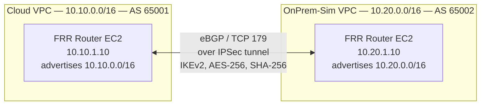
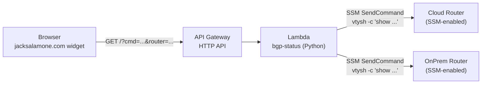

# Architecture

## Data path



## Public read-only query path



## Protocol stack

The lab demonstrates a real production protocol stack:

| Layer | Component | Implementation |
|---|---|---|
| Routing | BGP (eBGP between two ASes) | FRR (Free Range Routing) on Ubuntu |
| Reliability | TCP port 179 | Linux kernel TCP stack |
| Confidentiality | IPSec tunnel mode | strongSwan IKEv2 |
| Key exchange | IKEv2 | strongSwan with pre-shared key |
| Encryption | AES-256-CBC | strongSwan ESP |
| Integrity | HMAC-SHA-256 | strongSwan ESP |
| DH group | MODP-2048 (group 14) | strongSwan IKE |

This is the same stack AWS Site-to-Site VPN with BGP and AWS Direct Connect use under the hood. Configuring it manually proves understanding of every layer.

## Key configuration insight

FRR 10.x enforces eBGP connected-check by default — it silently refuses to initiate TCP connections to peers not in a directly-connected subnet. Since the peer is across an IPSec tunnel (not directly connected), `bgpd` never calls `connect()`. The fix:

```
neighbor 10.20.1.10 ebgp-multihop 2
neighbor 10.20.1.10 update-source eth0
```

Discovering this was the highest-value debugging moment in building the lab.
