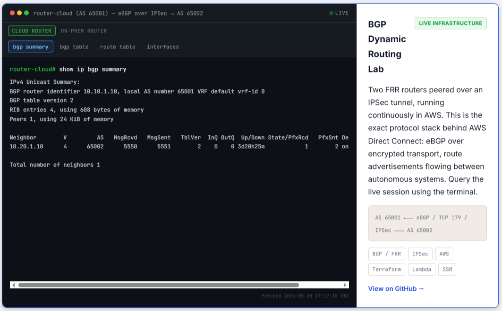

# AWS BGP Dynamic Routing Lab


BGP dynamic routing over an IPSec tunnel between two AWS VPCs — the same architectural pattern used in AWS Direct Connect and AWS Site-to-Site VPN with BGP. Built with FRR (Free Range Routing) on EC2 instances, configured from scratch. Demonstrates route propagation, BGP path selection, and dynamic failover without touching the AWS managed networking layer.

> ### Live in AWS right now
>
> BGP session has been ESTABLISHED 24/7 for multiple days between AS 65001 and AS 65002 over an IPSec tunnel. **Query the running routers yourself** via the live terminal widget on [jacksalamone.com](https://jacksalamone.com).
>
> 
>
> **Full deployment evidence, terminal captures, and additional screenshots:** [`evidence/`](evidence/)

## The Problem

Static routes work in a lab. In production hybrid networks, you need dynamic routing: routes that propagate automatically when new networks are added, paths that reroute around failures, and a protocol that scales to thousands of prefixes without manual maintenance. BGP is that protocol — it's the routing protocol of the internet and the backbone of every enterprise WAN.

Most cloud engineers know BGP exists. Almost none have configured it. This lab changes that.

**Connection to AWS:** When you enable dynamic routing on an AWS Site-to-Site VPN or configure Direct Connect, the managed BGP session AWS runs on the other side of that connection is doing exactly what this lab does manually.

## Architecture

```
┌─────────────────────────────────────────────────────────────────────┐
│                            AWS Region                               │
│                                                                     │
│   ┌──────────────────────────┐    ┌────────────────────────────┐   │
│   │  Cloud VPC               │    │  OnPrem-Sim VPC            │   │
│   │  10.10.0.0/16            │    │  10.20.0.0/16              │   │
│   │  AS 65001                │    │  AS 65002                  │   │
│   │                          │    │                            │   │
│   │  ┌──────────────────┐    │    │  ┌──────────────────────┐  │   │
│   │  │ FRR EC2          │    │    │  │ FRR EC2              │  │   │
│   │  │ BGP Router ID:   │◄───┼────┼─►│ BGP Router ID:       │  │   │
│   │  │ 10.10.1.10       │    │    │  │ 10.20.1.10           │  │   │
│   │  │                  │ IKEv2   │  │                      │  │   │
│   │  │ Advertises:      │ IPSec   │  │ Advertises:          │  │   │
│   │  │ 10.10.0.0/16     │    │    │  │ 10.20.0.0/16         │  │   │
│   │  └──────────────────┘    │    │  └──────────────────────┘  │   │
│   │                          │    │                            │   │
│   │  BGP Table:              │    │  BGP Table:                │   │
│   │  10.10.0.0/16 (local)    │    │  10.20.0.0/16 (local)     │   │
│   │  10.20.0.0/16 (via BGP)  │    │  10.10.0.0/16 (via BGP)   │   │
│   └──────────────────────────┘    └────────────────────────────┘   │
└─────────────────────────────────────────────────────────────────────┘
```

*Full diagram: [docs/architecture.png](docs/architecture.png)*

| Parameter | Cloud | OnPrem-Sim |
|-----------|-------|------------|
| VPC CIDR | 10.10.0.0/16 | 10.20.0.0/16 |
| BGP AS Number | 65001 | 65002 |
| BGP Router ID | 10.10.1.10 | 10.20.1.10 |
| BGP Neighbor IP | 10.20.1.10 (via tunnel) | 10.10.1.10 (via tunnel) |

## How It Works

### BGP Over IPSec: The Layering

```
Application data
└── TCP/IP
    └── ESP (IPSec encryption) ← strongSwan encrypts here
        └── UDP 4500 (NAT-T)
            └── IP → EIP
```

BGP sessions run over the IPSec tunnel using the private IPs of the tunnel endpoints as neighbor addresses. From BGP's perspective, the neighbors are directly connected — it doesn't see the encryption layer. strongSwan handles the encryption transparently.

### BGP Session Establishment

1. FRR sends a TCP SYN to neighbor's private IP on port 179
2. strongSwan intercepts the packet, encrypts it, sends via IPSec tunnel
3. Remote strongSwan decrypts, delivers to remote FRR
4. FRR sends OPEN message with ASN, BGP version, hold time
5. Remote FRR responds, KEEPALIVE exchange, session moves to ESTABLISHED
6. Both routers send UPDATE messages advertising their networks
7. Routes install in BGP RIB and kernel routing table

### Route Advertisement and Propagation

Each FRR instance advertises its local VPC CIDR via BGP `network` statement. When received by the peer, the route installs in the BGP table and is redistributed into the kernel routing table — making it available for forwarding.

```
# On Cloud FRR: what you see after BGP is established
show ip bgp

   Network          Next Hop            Metric LocPrf Weight Path
*> 10.10.0.0/16    0.0.0.0                  0         32768 i  ← local
*> 10.20.0.0/16    10.20.1.10               0             0 65002 i  ← learned via BGP
```

### How This Maps to AWS Direct Connect

AWS Direct Connect uses BGP exactly this way:
- Your on-prem router establishes eBGP with an AWS VGW (Virtual Private Gateway)
- Your router advertises your on-prem prefixes; AWS advertises your VPC CIDRs
- Route propagation to VPC route tables is automatic when "Propagate VGW routes" is enabled
- This lab replicates that model in software, showing the mechanics

## Prerequisites

- AWS account (Free Tier eligible)
- Terraform >= 1.5
- AWS CLI configured
- EC2 key pair
- Recommended: Complete [aws-hybrid-vpn-lab](https://github.com/SalamoneJack/aws-hybrid-vpn-lab) first — this lab extends it

## Quick Start

```bash
git clone https://github.com/SalamoneJack/aws-bgp-dynamic-routing-lab.git
cd aws-bgp-dynamic-routing-lab/terraform

cp terraform.tfvars.example terraform.tfvars
terraform init
terraform apply
```

This deploys the same two-VPC IPSec infrastructure from the VPN lab, plus installs FRR via user data.

## BGP Configuration

### Cloud FRR Instance — `/etc/frr/frr.conf`

```
frr version 8.x
frr defaults traditional
hostname cloud-router
!
router bgp 65001
 bgp router-id 10.10.1.10
 no bgp ebgp-requires-policy
 neighbor 10.20.1.10 remote-as 65002
 neighbor 10.20.1.10 description onprem-sim
 !
 address-family ipv4 unicast
  network 10.10.0.0/16
  neighbor 10.20.1.10 activate
 exit-address-family
!
```

### OnPrem-Sim FRR Instance — `/etc/frr/frr.conf`

```
frr version 8.x
frr defaults traditional
hostname onprem-router
!
router bgp 65002
 bgp router-id 10.20.1.10
 no bgp ebgp-requires-policy
 neighbor 10.10.1.10 remote-as 65001
 neighbor 10.10.1.10 description cloud
 !
 address-family ipv4 unicast
  network 10.20.0.0/16
  neighbor 10.10.1.10 activate
 exit-address-family
!
```

Enable and start FRR: `sudo systemctl enable frr && sudo systemctl start frr`

## Verification

```bash
# BGP session state — should show Established
vtysh -c "show ip bgp summary"

# BGP routing table — should show both networks
vtysh -c "show ip bgp"

# Kernel routing table — should include BGP-learned routes
ip route show

# End-to-end ping across the tunnel
ping 10.20.1.x
```

See `evidence/` for expected BGP table output.

## Dynamic Routing Demo: Adding a New Network

Add a new subnet to the OnPrem-Sim VPC and advertise it via BGP — without touching the Cloud VPC's route tables:

```hcl
# terraform/main.tf — add a new subnet
resource "aws_subnet" "onprem_extra" {
  vpc_id     = aws_vpc.onprem.id
  cidr_block = "10.20.2.0/24"
}
```

```
# On OnPrem FRR — add to bgpd config
network 10.20.2.0/24
```

The new prefix propagates to Cloud FRR's BGP table automatically. This is the value of dynamic routing: new networks self-advertise.

## Production Considerations

| Aspect | This Lab | Production (Direct Connect + BGP) |
|--------|----------|----------------------------------|
| BGP peer | FRR on EC2 | On-prem router (Cisco, Juniper, Arista) |
| AS numbers | Private (65001, 65002) | Real private or public ASNs |
| Route filtering | None | Prefix lists, route maps to control what's accepted |
| Failover | Manual (stop FRR) | BFD for sub-second failure detection |
| Redundancy | Single BGP session | Two DX connections, two BGP sessions per VGW |
| Monitoring | vtysh CLI | CloudWatch DX metrics + BGP state alarms |

**For healthcare/enterprise:** Direct Connect + BGP with MED attributes lets you control primary/backup path selection at the routing protocol level — far more reliable than static routes with health-check failover.

## Cost

| Resource | Monthly Cost |
|----------|-------------|
| 2× t2.micro EC2 (Free Tier) | $0 |
| 2× Elastic IPs | $0 |
| **Total** | **$0** |

## What I Learned

- BGP runs on top of TCP port 179 — the transport layer handles reliability, which is why BGP itself is relatively simple (no flooding, no complex hello mechanisms)
- `no bgp ebgp-requires-policy` is a FRR safety valve — in production you'd want explicit prefix-list filtering to control what you accept from eBGP peers
- The BGP neighbor address must be reachable via the routing table *before* the session establishes — BGP and IGP (or static routes) have a chicken-and-egg dependency that's easy to debug wrong
- FRR's `vtysh` CLI is nearly identical to IOS: `show ip bgp summary` is `show ip bgp summary`, `show ip route bgp` is `show ip route bgp`. The mental model transfers directly
- AWS VGW route propagation is just this: AWS runs FRR (or equivalent), and when you enable propagation, it writes the BGP-learned routes to your route table automatically

## Related Projects

- [aws-hybrid-vpn-lab](https://github.com/SalamoneJack/aws-hybrid-vpn-lab) — The IPSec foundation this lab builds on
- [aws-network-monitoring](https://github.com/SalamoneJack/aws-network-monitoring) — Observability layer for this setup
