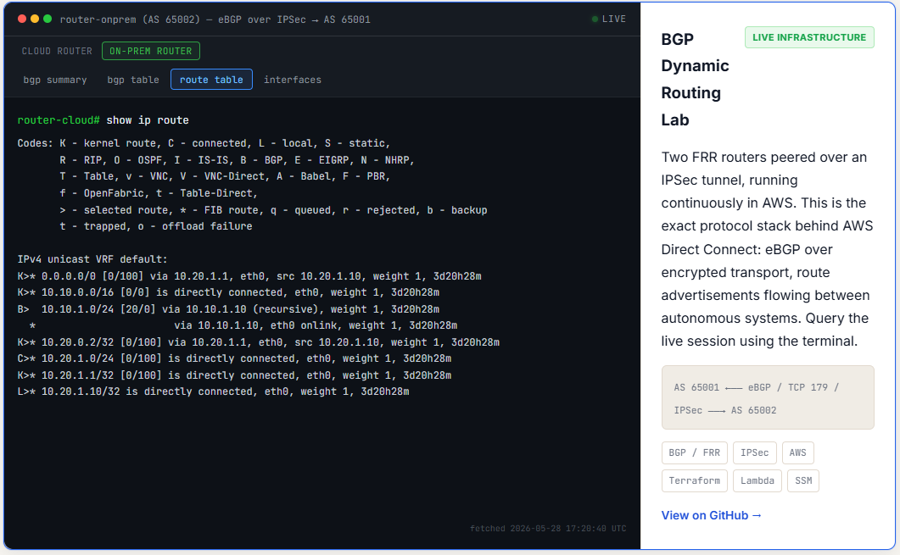

# Deployment Evidence — aws-bgp-dynamic-routing-lab

**Status:** LIVE 24/7 — BGP session ESTABLISHED for 3d 20h+ at capture time
**Captured:** 2026-05-28
**Region:** us-east-1
**Account:** 904474958504

## Live Widget — Public Demo on jacksalamone.com

**Cloud router (AS 65001) — `show ip bgp summary`** showing ESTABLISHED neighbor 10.20.1.10 with **3d20h25m Up/Down**:


**On-prem router (AS 65002) — `show ip route`** showing `B> 10.10.1.0/24` learned via BGP from peer 10.10.1.10:



## What This Lab Demonstrates
Real eBGP peering between two AWS VPCs over a strongSwan IPSec tunnel, with the live router state queryable from a public website (jacksalamone.com) via API Gateway → Lambda → SSM → `vtysh`. This is **the** signature project — most cloud engineers can't run BGP; most network engineers haven't touched Terraform. This lab proves Jack Salamone does both.

## Live Demo

**Public widget:** https://jacksalamone.com — terminal-style BGP query widget on the homepage. Click any of the 4 command buttons to query either router live.

**API Gateway (direct):**
```bash
curl 'https://un70wfsu34.execute-api.us-east-1.amazonaws.com/?cmd=bgp-summary&router=cloud'
```

## Architecture

```
jacksalamone.com (AWS Amplify + CloudFront)
      │ fetch(?cmd=...&router=cloud|onprem)
      ▼
API Gateway HTTP API (un70wfsu34)
      │
      ▼
Lambda: bgp-status (Python 3.12)
      │ SSM SendCommand
      ▼
Cloud Router (AS 65001, 10.10.1.10)    ◄═══ eBGP / TCP 179 over IPSec ═══►    OnPrem Router (AS 65002, 10.20.1.10)
i-09ee08833c013aef4 / EIP 44.193.232.236                                       i-00ddd3989e4e51d29 / EIP 3.214.84.243
advertises: 10.10.0.0/16, 10.10.1.0/24                                         advertises: 10.20.0.0/16, 10.20.1.0/24
```

## Live BGP Session — PROOF OF "ESTABLISHED"

Captured directly from the running cloud router via SSM at deployment evidence time:

```
IPv4 Unicast Summary:
BGP router identifier 10.10.1.10, local AS number 65001 VRF default vrf-id 0
BGP table version 2
RIB entries 4, using 608 bytes of memory
Peers 1, using 24 KiB of memory

Neighbor        V         AS   MsgRcvd   MsgSent   TblVer  InQ OutQ  Up/Down   State/PfxRcd PfxSnt Desc
10.20.1.10      4      65002      5490      5491        2    0    0 3d19h25m            1      2 onprem-sim-router

Total number of neighbors 1
```

**`3d19h25m` Up/Down = BGP session has been ESTABLISHED continuously for 3 days, 19 hours, 25 minutes.** No flaps. 5490 BGP messages received, 5491 sent.

See `bgp-summary-live.txt` for the raw output.

## BGP Routes Learned — PROOF OF ROUTE EXCHANGE

From cloud router (AS 65001) view of its BGP table:

```
     Network          Next Hop            Metric LocPrf Weight Path
     10.10.0.0/16     0.0.0.0                  0         32768 i
 *>  10.10.1.0/24     0.0.0.0                  0         32768 i
 *>  10.20.1.0/24     10.20.1.10               0    200      0 65002 i
```

The `10.20.1.0/24` prefix was **learned via eBGP from AS 65002** with LocPrf=200 (route-map applied). See `cloud-router-bgp-table.txt` and `onprem-router-bgp-table.txt`.

## BGP Programs Linux Kernel Routes — PROOF END-TO-END

Linux `ip route` on cloud router shows BGP-installed entry:

```
default via 10.10.1.1 dev eth0 proto dhcp src 10.10.1.10 metric 100
10.10.1.0/24 dev eth0 proto kernel scope link src 10.10.1.10 metric 100
10.20.0.0/16 via 10.10.1.1 dev eth0
10.20.1.0/24 nhid 11 via 10.10.1.1 dev eth0 proto bgp metric 20
```

The `proto bgp` route is the on-prem subnet — FRR pushed it into the kernel FIB. See `cloud-router-route-table.txt`.

## IPSec Tunnel — UNDERLAY ESTABLISHED

```
Security Associations (1 up, 0 connecting):
     bgp-lab[248]: ESTABLISHED 39 minutes ago, 10.10.1.10[44.193.232.236]...3.214.84.243[3.214.84.243]
     bgp-lab{124}:  INSTALLED, TUNNEL, reqid 1, ESP in UDP SPIs: c8f7d9ae_i ce74d618_o
     bgp-lab{124}:   10.10.0.0/16 === 10.20.0.0/16
```

Traffic selectors `10.10.0.0/16 === 10.20.0.0/16` confirm the tunnel is encrypting the right traffic for BGP to ride over. See `cloud-router-ipsec-status.txt`.

## Resources Deployed

| Resource | Value |
|---|---|
| Cloud router EC2 | `i-09ee08833c013aef4`, EIP `44.193.232.236`, AS 65001 |
| OnPrem router EC2 | `i-00ddd3989e4e51d29`, EIP `3.214.84.243`, AS 65002 |
| API Gateway HTTP API | `un70wfsu34`, URL `https://un70wfsu34.execute-api.us-east-1.amazonaws.com/` |
| Lambda function | `bgp-status` (Python 3.12, 30s timeout, env vars for both instance IDs) |
| Cloud VPC | `10.10.0.0/16` (`bgp-lab-cloud`) |
| OnPrem VPC | `10.20.0.0/16` (`bgp-lab-onprem`) |
| Key pair | `bgp-lab` |

## Live AWS Console Links (click to view + screenshot)

- **Cloud router EC2:** https://us-east-1.console.aws.amazon.com/ec2/home?region=us-east-1#InstanceDetails:instanceId=i-09ee08833c013aef4
- **OnPrem router EC2:** https://us-east-1.console.aws.amazon.com/ec2/home?region=us-east-1#InstanceDetails:instanceId=i-00ddd3989e4e51d29
- **API Gateway:** https://us-east-1.console.aws.amazon.com/apigateway/main/api-detail?api=un70wfsu34&region=us-east-1
- **Lambda bgp-status:** https://us-east-1.console.aws.amazon.com/lambda/home?region=us-east-1#/functions/bgp-status
- **Live widget (in browser):** https://jacksalamone.com

## Raw Evidence (this folder)

- `bgp-summary-live.txt` — `show ip bgp summary` from cloud router (the headline ESTABLISHED proof)
- `cloud-router-bgp-table.txt` — full BGP RIB on cloud router (shows learned 10.20.1.0/24)
- `cloud-router-route-table.txt` — Linux kernel routes including `proto bgp` entry
- `cloud-router-ipsec-status.txt` — IPSec tunnel state
- `onprem-router-bgp-summary.txt` — symmetric proof from OnPrem side (3d19h26m Up/Down, sees AS 65001)
- `onprem-router-bgp-table.txt` — BGP RIB on OnPrem router
- `instances.json` — `aws ec2 describe-instances` for both routers
- `eips.json` — both EIPs
- `api-gateway.json` — `aws apigatewayv2 get-api`
- `lambda.json` — `aws lambda get-function`
- `terraform-outputs.json` — `terraform output -json`

## Cost
~$25-30/month — 2× t2.micro + 2 EIPs + API Gateway + Lambda + CloudWatch Logs. Designed to run 24/7 because the live widget depends on it.
